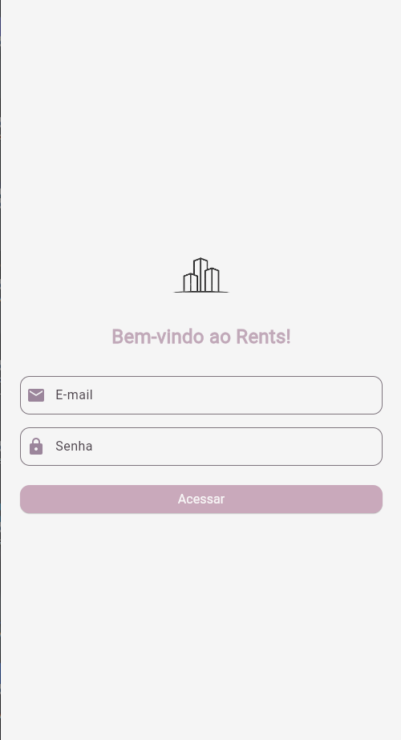
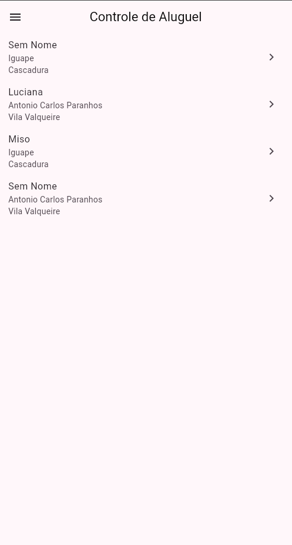
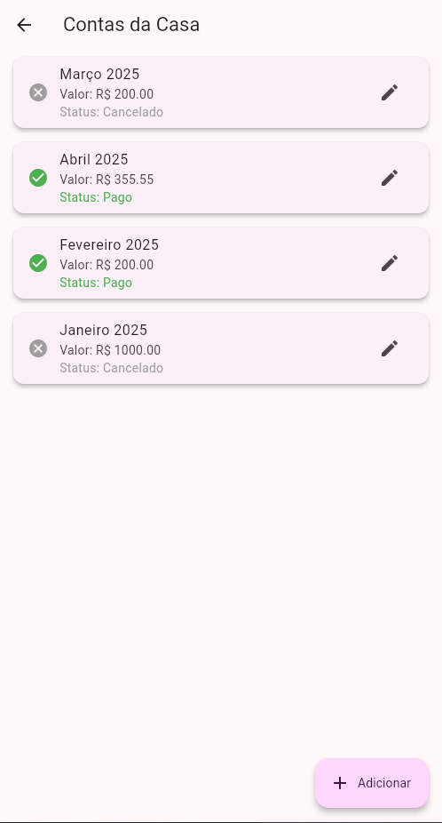
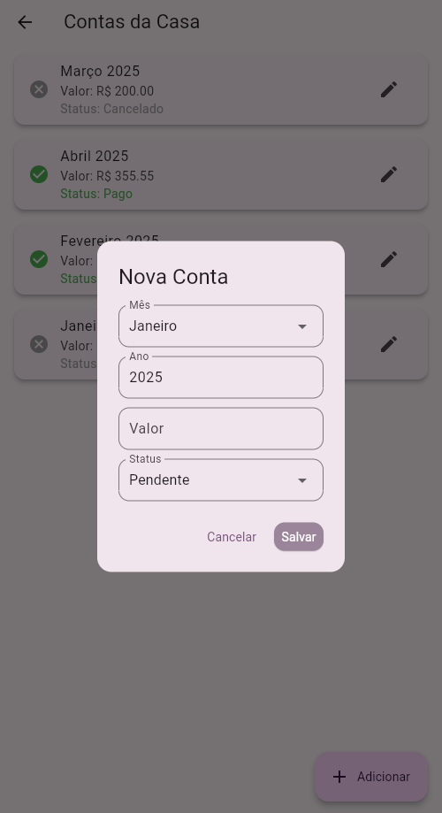
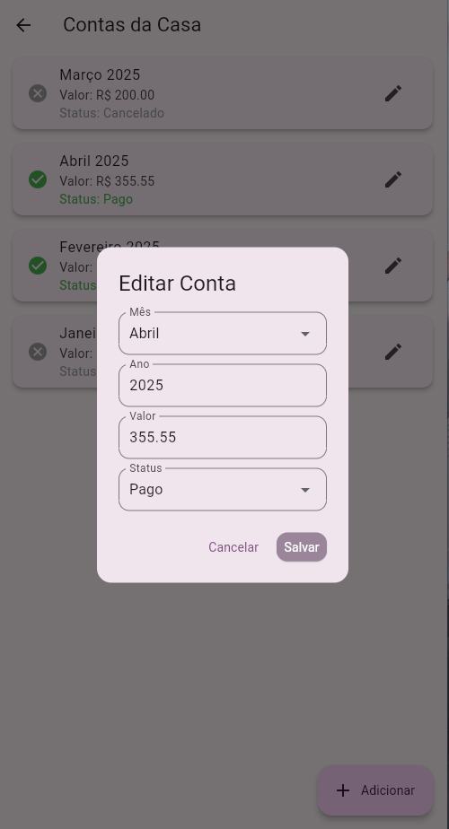
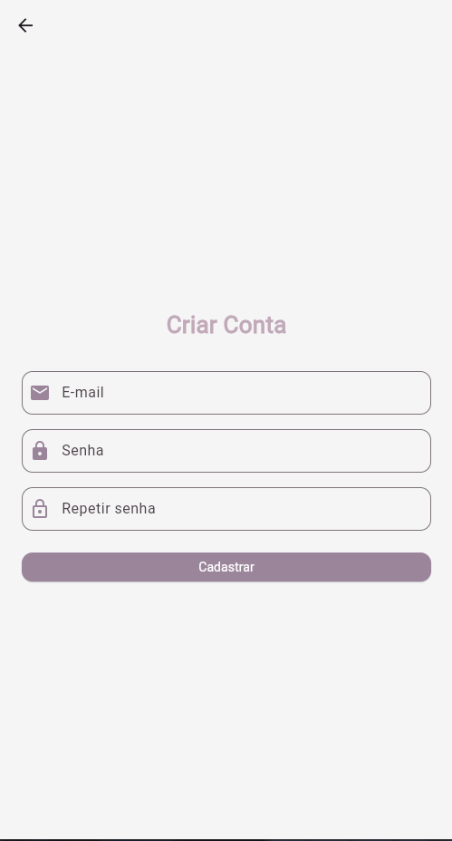
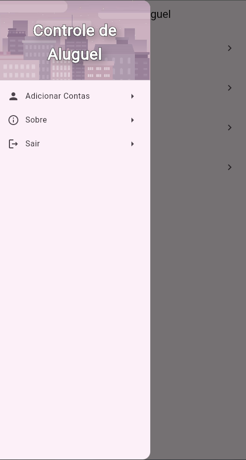
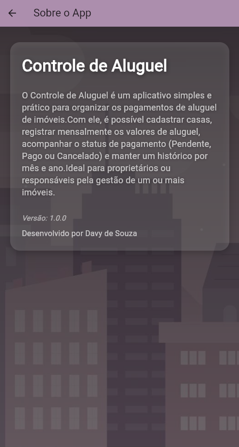
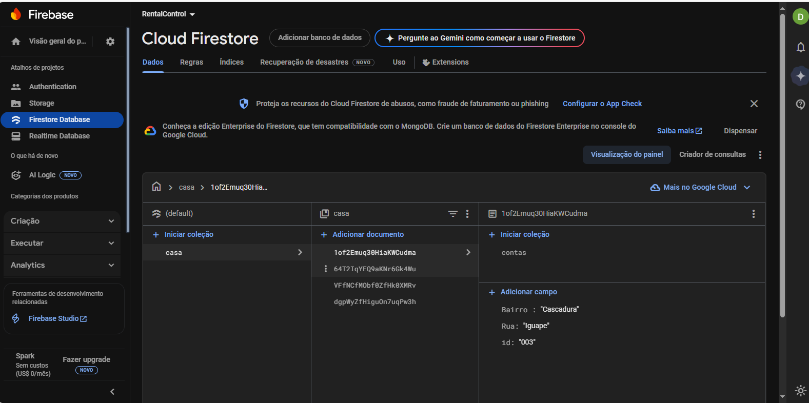
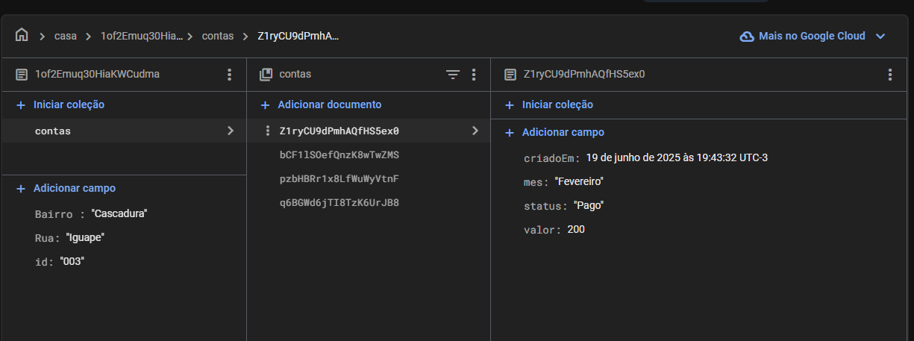

# 📊 RentControl – Gerenciamento de Contas de Aluguel

RentControl é um aplicativo desenvolvido em Flutter que permite ao **locatário** controlar de forma prática as **contas mensais de aluguel** de diferentes imóveis. O sistema também abre possibilidades futuras para que **inquilinos** acompanhem o andamento dos pagamentos, promovendo **transparência, organização e segurança** para ambas as partes.

---

## 🧠 Ideia por trás do projeto

A proposta inicial do RentControl é oferecer ao **locatário** uma ferramenta intuitiva para registrar, acompanhar e atualizar o status de contas (Pagas, Pendentes ou Canceladas) relacionadas a cada casa ou imóvel alugado.

Futuramente, o sistema contará com **hierarquia de permissões**, permitindo a diferenciação entre os acessos do **locatário** e do **inquilino**, com cada um visualizando apenas as informações relevantes.

---

## 🚀 Funcionalidades

- ✅ Cadastro de imóveis (nome, bairro e rua)
- 📅 Lançamento mensal de contas (valor, mês, ano e status)
- 🔄 Atualização e exclusão de contas
- 📍 Obtenção automática de localização para preenchimento de endereço
- 🔒 Sistema de autenticação (cadastro e login com Firebase Auth)
- 📡 Integração com Firebase Firestore em tempo real
- 🧭 Interface amigável e responsiva para diferentes dispositivos

---

## 🛠️ Tecnologias Utilizadas

- **Flutter** – UI e lógica do app
- **Firebase Firestore** – Armazenamento de dados
- **Firebase Auth** – Autenticação de usuários
- **Geolocator** – Obtenção da localização via GPS
- **Nominatim API (OpenStreetMap)** – Conversão de coordenadas em endereços
- **Provider** – Gerenciamento de estado
- **Gradle + Keytool** – Assinatura de builds para publicação

---

## 📸 Capturas de Tela 

### Tela Login

### Tela Home

### Tela de Contas

### Adicionar Conta

### Editar Conta


### Cadastro de Usuarios


### Drawer Menu


### Sobre Page


**Firestore com os dados**




## 📸 Videos
<video width="600" controls>
  <source src="assets/Videos/Controle de Aluguel - Google Chrome 2025-06-24 21-57-31.mp4" type="video/mp4">
  Seu navegador não suporta vídeo.
</video>


## 📦 Como executar

1. **Clone o repositório**  
   ```bash
   git clone https://github.com/seu-usuario/rentcontrol.git
   cd rentcontrol
## Cobertura de Teste
**Cabertura de Teste**

